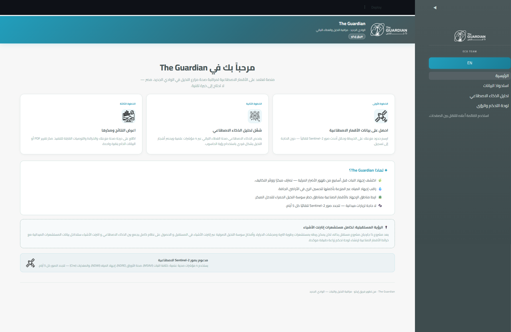
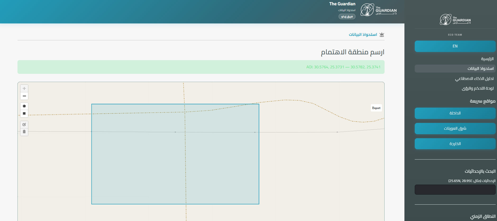
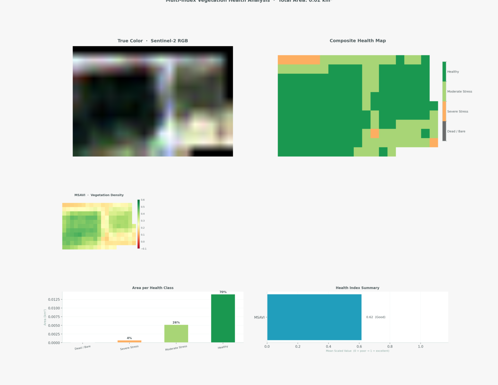
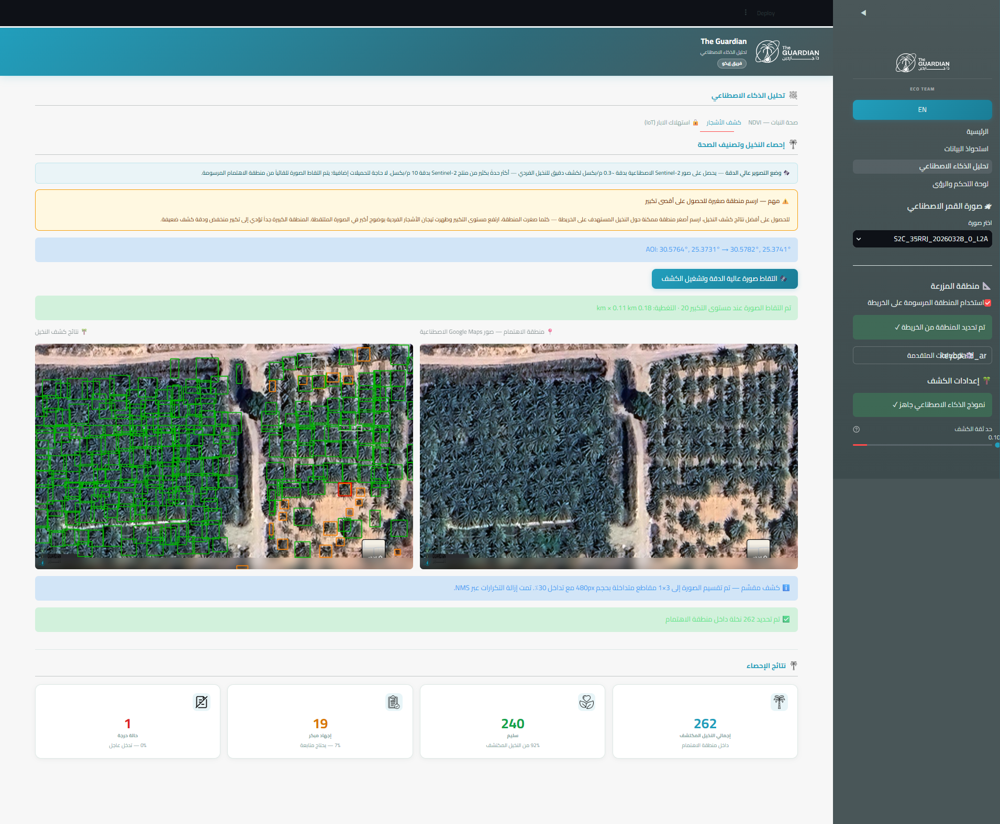
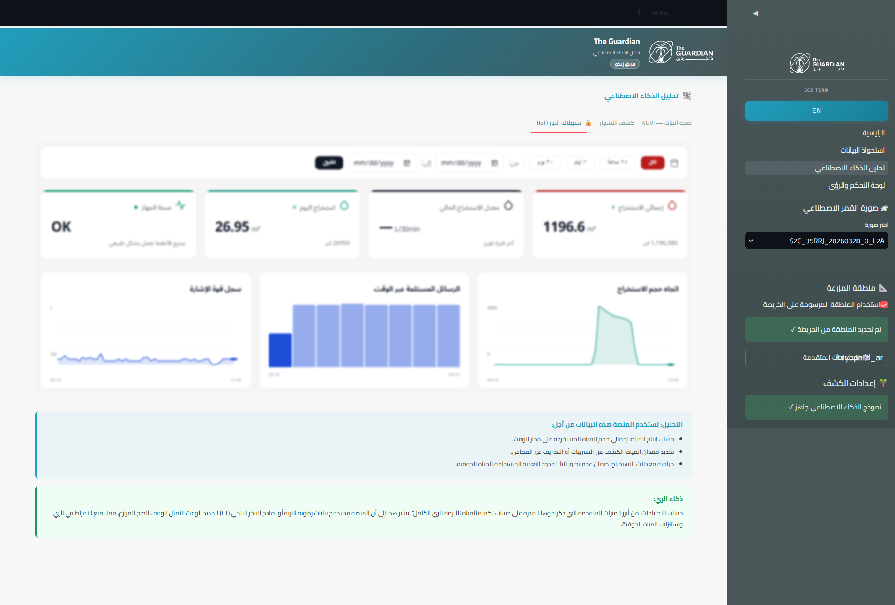
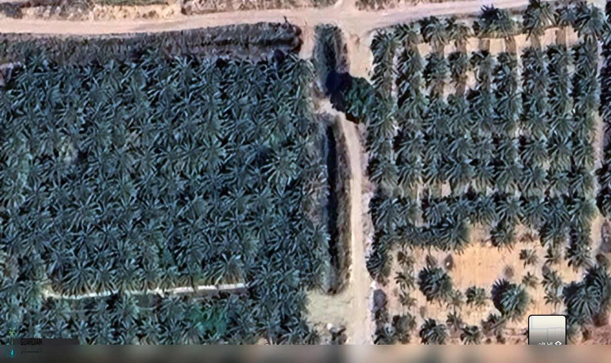
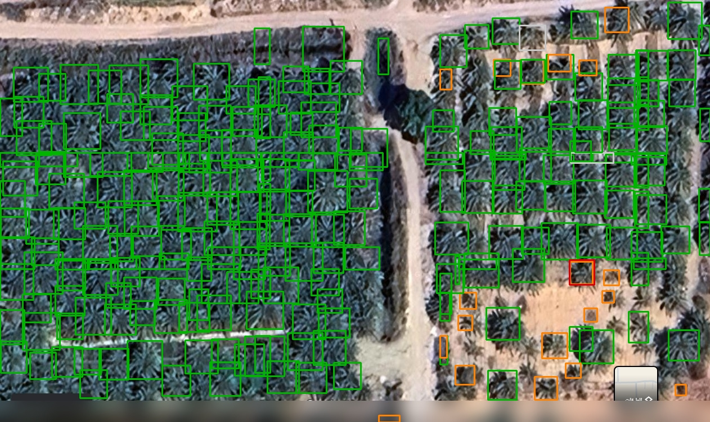
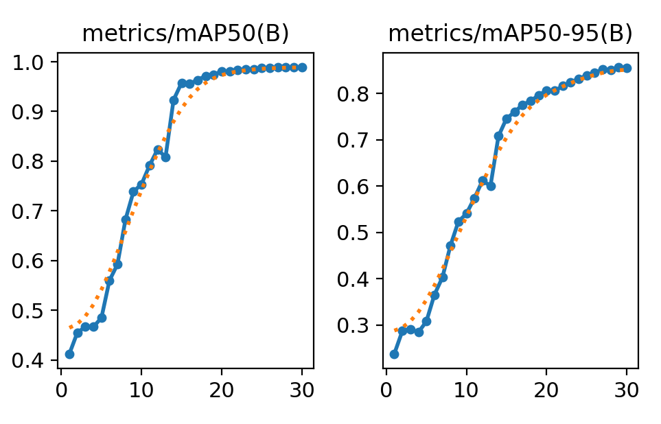
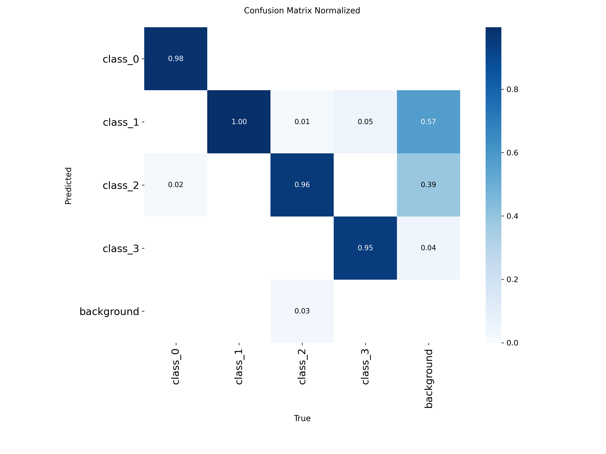

# The Guardian · Eco Team


> **Satellite-powered vegetation monitoring and palm tree health assessment platform** — free data, real-time AI analysis, actionable reports.

---

## Overview

The Guardian is a multi-page Streamlit application that automates the full pipeline from satellite image acquisition to AI-driven palm tree health reporting. Users define an area of interest on an interactive map, the system fetches Copernicus Sentinel-2 imagery automatically, runs composite vegetation analysis and palm tree detection, and produces a detailed PDF report — all within a single browser session.

---

## Problem & Solution

| Challenge | Our Solution |
|-----------|-------------|
| Manual farm inspection is slow, expensive, and error-prone | Automated satellite monitoring at 10 m/pixel resolution |
| Raw NDVI fails in arid/desert soils due to soil brightness | Multi-index composite (MSAVI + NDRE + NDWI + CIre) tuned for arid regions |
| Palm health assessment requires trained agronomists | **Eco_palm_model** detects and classifies each tree in seconds |
| Reports require manual compilation | One-click PDF/Word export with English & Arabic support |

---

## Added Value & Benefits

- **Free data** — Copernicus Sentinel-2 is publicly available; no satellite subscription required
- **Early stress detection** — NDRE catches chlorophyll decline weeks before visible symptoms
- **Tree-level census** — count, locate, and classify every palm tree in the AOI
- **Economic forecast** — composite health score maps to a yield outlook (Positive / Moderate / At Risk)
- **Bilingual** — full Arabic RTL interface and downloadable Arabic PDF report
- **Scalable** — tiled detection handles large farm AOIs automatically

---

## Data Source — Copernicus Sentinel-2

| Property | Value |
|----------|-------|
| Provider | ESA / Copernicus (free & open-access) |
| Product level | L2A (atmospherically corrected surface reflectance) |
| Spatial resolution | 10 m/pixel (B04, B08); 20 m/pixel (B05, B07, B8A, B11) |
| Revisit time | ~5 days at the equator |
| Access | Sentinel Hub API / sentinelsat — no cost |

---

## Vegetation Indicators

Four spectral indices are computed and combined into a weighted composite health score:

| Index | Formula | Bands | Weight | Purpose |
|-------|---------|-------|--------|---------|
| **MSAVI** | `(2·NIR+1 − √((2·NIR+1)²−8·(NIR−R)))/2` | B04, B08 | 20% | Soil-corrected greenness; safe for arid/bare-soil regions |
| **NDRE** | `(NIR − RE) / (NIR + RE)` | B05, B08 | 35% | Red-edge chlorophyll; detects early stress before visible damage |
| **NDWI** | `(NIR − SWIR) / (NIR + SWIR)` | B8A, B11 | 30% | Canopy water content; drought and irrigation stress |
| **CIre** | `(RE3 / RE1) − 1` | B05, B07 | 15% | Red-edge chlorophyll concentration |

**Health classes** from the composite:

| Score Range | Class | Colour |
|------------|-------|--------|
| > 0.55 | Healthy | Dark Green |
| 0.30 – 0.55 | Moderate Stress | Soft Green |
| 0.15 – 0.30 | Severe Stress | Orange |
| ≤ 0.15 | Dead / Bare | Grey |

**Scientific references:**
- Qi et al. (1994) — *A modified soil adjusted vegetation index.* Remote Sensing of Environment, 48(2), 119–126.
- Gitelson & Merzlyak (1994) — *Spectral reflectance changes associated with autumn senescence.* Journal of Plant Physiology, 143(3), 286–292.
- Gao (1996) — *NDWI — A normalized difference water index for remote sensing of vegetation liquid water.* Remote Sensing of Environment, 58(3), 257–266.
- Gitelson et al. (2003) — *Relationships between leaf chlorophyll content and spectral reflectance.* Journal of Plant Physiology, 160(3), 271–282.

---

## Platform Workflow

```
Step 1 — Data Acquisition          Step 2 — AI Analysis               Step 3 — Dashboard & Report
────────────────────────           ──────────────────────             ───────────────────────────
Draw AOI on map         ──►        Vegetation health map   ──►        Health score summary
Select Sentinel-2 product          NDVI composite (MSAVI …)           Palm census table
Auto-download & cache bands        Palm tree detection                 Economic yield outlook
                                   IoT sensor overview                 Download PDF / Word report
```

---

## Screenshots

### Home


### Data Acquisition


### Vegetation Health Analysis


### Palm Tree Detection


### IoT / Future Work


---

## Input → Output Example

| Input (Sentinel-2 True Color) | Output (Annotated Detection) |
|-------------------------------|------------------------------|
|  |  |

Detection classes: 🟢 **Healthy** · 🟠 **Early Stress** · 🔴 **Critical Condition**

---

## Eco_palm_model Performance

The palm tree detection model (`Eco_palm_model`) was trained on **2,815 satellite crop images** across 3 health classes.

### Training Summary

| Epoch | Precision | Recall | mAP50 | mAP50-95 |
|-------|-----------|--------|-------|----------|
| 1 | 92.5% | 38.0% | 41.2% | 23.8% |
| 5 | 93.3% | 44.8% | 48.5% | 30.8% |
| 10 | 66.6% | 74.1% | 75.4% | 54.1% |
| 15 | 90.3% | 91.8% | 95.8% | 74.6% |
| 20 | 96.1% | 94.2% | 98.0% | 80.6% |
| 25 | 98.1% | 94.9% | 98.7% | 83.9% |
| **30** | **97.1%** | **95.8%** | **98.9%** | **85.6%** |

### Training Curve


### Confusion Matrix (Normalized)


### Demo Detection Results

| Condition | Count | Proportion |
|-----------|-------|-----------|
| Healthy | 240 | 91.6% |
| Early Stress | 19 | 7.25% |
| Critical Condition | 1 | 0.38% |
| **TOTAL** | **262** | **100%** |

---

## Future Work

- **Live IoT integration** — real-time well water levels, soil moisture sensors, irrigation flow meters
- **Time-series anomaly detection** — seasonal trend analysis and automated alerts for critical health zones
- **Multi-crop support** — extend detection beyond palm trees to citrus, olive, wheat
- **Edge deployment** — lightweight model inference on field devices without internet connectivity

---

## Usage

```bash
# 1. Clone the repository
git clone <repo-url>
cd guardian

# 2. Install dependencies
pip install -r requirements.txt

# 3. Run the app
streamlit run app.py
```

**Workflow:**
1. Open **Data Acquisition** → draw your AOI on the map → select a Sentinel-2 product → download bands
2. Open **AI Analysis** → run vegetation analysis + palm detection
3. Open **Dashboard Insights** → review health score, census, economic outlook → download report

---

## Requirements

```
streamlit          # Web application framework
streamlit-folium   # Interactive maps
rasterio           # GeoTIFF band loading
shapely / geopandas / pyproj  # Geospatial operations
numpy / matplotlib / Pillow   # Numerical + visualization
opencv-python      # Image processing
ultralytics        # Eco_palm_model inference
sentinelsat        # Sentinel-2 data access
boto3 / requests   # Data download
reportlab          # PDF report generation
arabic-reshaper / python-bidi  # Arabic RTL text rendering
```

---

## Team

**Eco Team** — The Guardian v2.0 · April 2026
